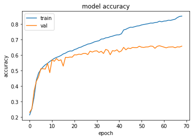
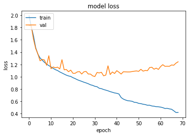

# Network For Emotion Recogntion from Facial Expressions using the FER dataset

[](https://www.codacy.com/gh/StraysWonderland/Neural-Network-for-Facial-Expression-Recognition/dashboard?utm_source=github.com&amp;utm_medium=referral&amp;utm_content=StraysWonderland/Neural-Network-for-Facial-Expression-Recognition&amp;utm_campaign=Badge_Grade)

This repository is a simple jupyter notebook that is trained on the Facial Expressions Recognition (FER2013) Dataset
Currently it does not include any additional data manipluation to avoid overfitting, but this might be added in the future

## Contributing to Hacktoberfest
If you want to start a pull request to contribute to hacktoberfest, either:
  - take a look at the issues which will include some simple tasks to implement
  - add  different model layout as new codeblock in the main file or in the TestNetworks/ subfolder.
  - add codeblocks to plot additional metrics
## Dataset
Simply load the FER2013 dataset from kaggle and place the csv in the ```data``` folder <br/>
Dataset can be downloaded from this [link](https://www.kaggle.com/deadskull7/fer2013)

## Requirements
  - tensorflow >= 2.2
  - jupyter notebook
  - python >= 3.8
  - numpy
  - Pandas
  - sklearn

the required virtual environment can be created from either the ```requirements.txt``` or the ```environment.yaml``` in the requirements folder

## workflow

run 
```bash
jupyter notebook
```

and go through all the codeblocks if you want to train the network from scratch.
the model also saves its architecture and weights to json and hdf file so they can be later on loaded for testing without re-training
to do so ; only run the blocks below the ```loading the model``` codeblock

## Accuracy

Our network achieves around 65% test accuracy
<p align="center">

</p>

### loss

Here is the plot for the loss function:
<p align="center">

</p>
it suffers from overfitting a lot so in future i might add data manipulation or experiment with the network layout
Feel free to contribute to the network layout for better accuracy.
